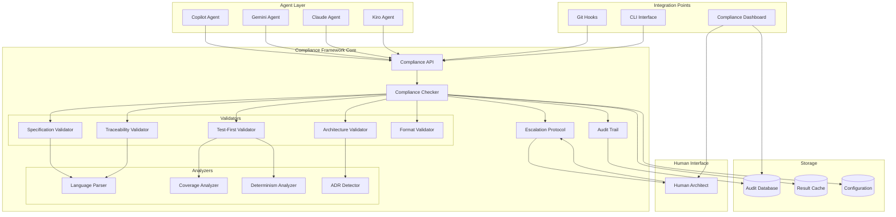

# Design Document: ADE Compliance Framework

## Overview

The ADE Compliance Framework is a language-agnostic, agentic-first system that enforces Axiom Driven Engineering (ADE) principles throughout the software development lifecycle. The framework operates as a constitutional enforcement layer, ensuring that all development activities—whether performed by humans or AI agents—adhere to fundamental ADE axioms.

### Core Design Principles

1. **Constitutional Enforcement**: All operations are validated against ADE axioms before execution
2. **Human Architect Supremacy**: The Human Architect maintains final authority on all axiom interpretations and disputes
3. **Agentic Self-Governance**: Agents proactively self-check compliance before tool execution
4. **Language Agnostic**: Support for Python, TypeScript, JavaScript, Java, and extensible to other languages
5. **Performance First**: All checks complete within 10 seconds to avoid disrupting workflow
6. **Immutable Audit Trail**: All decisions are logged with axiom references for full traceability
7. **Zero Violations in Production**: No code with compliance violations reaches production without explicit Human Architect override

### Key Capabilities

- **Automated Compliance Checking**: Real-time validation of specification-first (Π.1.1), test-driven (Π.2.1), traceability (Π.3.1), and architecture (Π.4.1) axioms
- **Pre-Commit Quality Gates**: Git hooks that block commits containing violations
- **Escalation Protocol**: Automatic routing of critical decisions to Human Architect
- **Audit Trail**: Immutable logging of all decisions with axiom references
- **Compliance Dashboard**: Real-time visualization of axiom adherence across the project
- **Multi-Agent Support**: Common interface for Copilot, Gemini, Claude, and Kiro agents
- **Workflow Integration**: Compliance checks at every phase of the development lifecycle

## Architecture

### System Architecture Diagram



### Component Architecture

The system follows a layered architecture with clear separation of concerns:

1. **Agent Layer**: Provides a unified interface for all AI agent types
2. **Compliance Core**: Orchestrates validation, escalation, and audit logging
3. **Validator Layer**: Specialized validators for each axiom category
4. **Analyzer Layer**: Language-specific parsers and analysis tools
5. **Integration Layer**: Git hooks, CLI, and dashboard interfaces
6. **Storage Layer**: Persistent storage for audit trails, cache, and configuration
7. **Human Interface**: Escalation and override mechanisms for Human Architect

## Components and Interfaces

### 1. Compliance API

The central interface for all compliance operations.

**Interface:**
```python
class ComplianceAPI:
    def check_compliance(
        self,
        context: ComplianceContext,
        checks: List[CheckType] = None
    ) -> ComplianceResult:
        """
        Run compliance checks for the given context.
        
        Args:
            context: The context to check (code, spec, commit, etc.)
            checks: Specific checks to run, or None for all applicable checks
            
        Returns:
            ComplianceResult with pass/fail status and detailed findings
        """
        pass
    
    def register_agent(
        self,
        agent_type: AgentType,
        agent_id: str
    ) -> AgentSession:
        """Register an agent and create a session."""
        pass
    
    def escalate_decision(
        self,
        decision: Decision,
        context: EscalationContext
    ) -> EscalationResult:
        """Escalate a decision to Human Architect."""
        pass
    
    def record_decision(
        self,
        decision: Decision,
        axiom_refs: List[AxiomReference]
    ) -> AuditEntry:
        """Record a decision in the audit trail."""
        pass
    
    def query_audit_trail(
        self,
        filters: AuditFilters
    ) -> List[AuditEntry]:
        """Query the audit trail with filters."""
        pass
```

### 2. Compliance Checker

Orchestrates all validation checks and determines overall compliance status.

**Interface:**
```python
class ComplianceChecker:
    def __init__(
        self,
        config: ComplianceConfig,
        validators: List[Validator],
        audit_trail: AuditTrail
    ):
        pass
    
    def check(
        self,
        context: ComplianceContext
    ) -> ComplianceResult:
        """
        Execute all applicable validators and aggregate results.
        
        Returns:
            ComplianceResult with overall status and individual check results
        """
        pass
    
    def check_specification_exists(
        self,
        task: Task
    ) -> ValidationResult:
        """Validate Π.1.1: Specification exists before implementation."""
        pass
    
    def check_tests_first(
        self,
        code_change: CodeChange
    ) -> ValidationResult:
        """Validate Π.2.1: Tests exist before implementation."""
        pass
    
    def check_traceability(
        self,
        artifact: Artifact
    ) -> ValidationResult:
        """Validate Π.3.1: Traceability links exist."""
        pass
    
    def check_architecture(
        self,
        change: ArchitecturalChange
    ) -> ValidationResult:
        """Validate Π.4.1: Architecture compliance."""
        pass
```

### 3. Specification Validator

Validates that specifications exist and follow required formats.

**Interface:**
```python
class SpecificationValidator(Validator):
    def validate(
        self,
        context: ComplianceContext
    ) -> ValidationResult:
        """
        Validate specification existence and format.
        
        Checks:
        - Requirements document exists
        - Design document exists
        - Documents follow required format
        - EARS patterns are used correctly
        - Correctness properties are properly formatted
        """
        pass
    
    def check_requirements_exist(
        self,
        spec_dir: Path
    ) -> bool:
        """Check if requirements.md exists."""
        pass
    
    def check_design_exists(
        self,
        spec_dir: Path
    ) -> bool:
        """Check if design.md exists."""
        pass
    
    def validate_ears_patterns(
        self,
        requirements: RequirementsDocument
    ) -> List[FormatViolation]:
        """Validate EARS pattern usage in requirements."""
        pass
    
    def validate_correctness_properties(
        self,
        design: DesignDocument
    ) -> List[FormatViolation]:
        """Validate correctness properties have 'for all' quantification."""
        pass
```

### 4. Test-First Validator

Validates that tests exist before implementation code.

**Interface:**
```python
class TestFirstValidator(Validator):
    def validate(
        self,
        context: ComplianceContext
    ) -> ValidationResult:
        """
        Validate test-first compliance.
        
        Checks:
        - Test files exist for implementation files
        - Tests cover the functionality being implemented
        - Tests are deterministic
        - Tests can run in any order
        """
        pass
    
    def find_test_file(
        self,
        impl_file: Path
    ) -> Optional[Path]:
        """Find the corresponding test file for an implementation file."""
        pass
    
    def check_coverage(
        self,
        impl_file: Path,
        test_file: Path
    ) -> CoverageResult:
        """Check if tests cover the implementation."""
        pass
    
    def check_determinism(
        self,
        test_file: Path
    ) -> List[DeterminismViolation]:
        """Check for non-deterministic patterns in tests."""
        pass
```

### 5. Traceability Validator

Validates that all artifacts have traceability links to requirements and axioms.

**Interface:**
```python
class TraceabilityValidator(Validator):
    def validate(
        self,
        context: ComplianceContext
    ) -> ValidationResult:
        """
        Validate traceability links.
        
        Checks:
        - Code modules link to requirements
        - Tests link to design properties or requirements
        - Requirements link to axioms
        - No broken links exist
        """
        pass
    
    def extract_traceability_links(
        self,
        artifact: Artifact
    ) -> List[TraceabilityLink]:
        """Extract traceability links from an artifact."""
        pass
    
    def validate_links(
        self,
        links: List[TraceabilityLink]
    ) -> List[BrokenLink]:
        """Validate that all links point to existing artifacts."""
        pass
    
    def generate_traceability_matrix(
        self,
        project: Project
    ) -> TraceabilityMatrix:
        """Generate a complete traceability matrix."""
        pass
```

### 6. Architecture Validator

Validates architectural decisions and ADR documentation.

**Interface:**
```python
class ArchitectureValidator(Validator):
    def validate(
        self,
        context: ComplianceContext
    ) -> ValidationResult:
        """
        Validate architecture compliance.
        
        Checks:
        - ADRs exist for architectural changes
        - ADRs include rationale, alternatives, consequences
        - Architectural patterns are followed
        - No pattern violations exist
        """
        pass
    
    def detect_architectural_change(
        self,
        change: CodeChange
    ) -> Optional[ArchitecturalChange]:
        """Detect if a code change affects architecture."""
        pass
    
    def find_adr(
        self,
        change: ArchitecturalChange
    ) -> Optional[ADR]:
        """Find the ADR documenting an architectural change."""
        pass
    
    def validate_adr_format(
        self,
        adr: ADR
    ) -> List[FormatViolation]:
        """Validate ADR includes required sections."""
        pass
```

### 7. Language Parser

Provides language-specific parsing for traceability extraction and analysis.

**Interface:**
```python
class LanguageParser:
    def parse_file(
        self,
        file_path: Path
    ) -> ParsedFile:
        """Parse a source file into an AST."""
        pass
    
    def extract_traceability_comments(
        self,
        parsed_file: ParsedFile
    ) -> List[TraceabilityLink]:
        """Extract traceability links from comments."""
        pass
    
    def extract_functions(
        self,
        parsed_file: ParsedFile
    ) -> List[Function]:
        """Extract function definitions."""
        pass
    
    def extract_classes(
        self,
        parsed_file: ParsedFile
    ) -> List[Class]:
        """Extract class definitions."""
        pass

class PythonParser(LanguageParser):
    """Python-specific parser implementation."""
    pass

class TypeScriptParser(LanguageParser):
    """TypeScript-specific parser implementation."""
    pass

class JavaScriptParser(LanguageParser):
    """JavaScript-specific parser implementation."""
    pass

class JavaParser(LanguageParser):
    """Java-specific parser implementation."""
    pass
```

### 8. Coverage Analyzer

Analyzes test coverage metrics.

**Interface:**
```python
class CoverageAnalyzer:
    def analyze_coverage(
        self,
        impl_file: Path,
        test_file: Path
    ) -> CoverageResult:
        """
        Analyze test coverage for an implementation file.
        
        Returns:
            Coverage metrics by module, file, and function
        """
        pass
    
    def calculate_line_coverage(
        self,
        impl_file: Path,
        test_file: Path
    ) -> float:
        """Calculate line coverage percentage."""
        pass
    
    def calculate_branch_coverage(
        self,
        impl_file: Path,
        test_file: Path
    ) -> float:
        """Calculate branch coverage percentage."""
        pass
    
    def identify_uncovered_code(
        self,
        impl_file: Path,
        test_file: Path
    ) -> List[UncoveredRegion]:
        """Identify specific code regions not covered by tests."""
        pass
```

### 9. Determinism Analyzer

Analyzes tests for non-deterministic patterns.

**Interface:**
```python
class DeterminismAnalyzer:
    def analyze_test(
        self,
        test_file: Path
    ) -> List[DeterminismViolation]:
        """
        Analyze a test file for non-deterministic patterns.
        
        Detects:
        - Random number generation without seeding
        - Time-based assertions
        - External state dependencies
        - Network calls
        - File system dependencies
        - Order-dependent tests
        """
        pass
    
    def check_for_randomness(
        self,
        parsed_test: ParsedFile
    ) -> List[DeterminismViolation]:
        """Check for unseeded random number generation."""
        pass
    
    def check_for_time_dependencies(
        self,
        parsed_test: ParsedFile
    ) -> List[DeterminismViolation]:
        """Check for time-based assertions."""
        pass
    
    def check_for_external_dependencies(
        self,
        parsed_test: ParsedFile
    ) -> List[DeterminismViolation]:
        """Check for external state dependencies."""
        pass
```

### 10. ADR Detector

Detects when architectural changes require ADR documentation.

**Interface:**
```python
class ADRDetector:
    def detect_architectural_change(
        self,
        change: CodeChange
    ) -> Optional[ArchitecturalChange]:
        """
        Detect if a code change affects system architecture.
        
        Architectural changes include:
        - New external dependencies
        - Changes to system boundaries
        - New communication patterns
        - Database schema changes
        - API contract changes
        """
        pass
    
    def classify_change_severity(
        self,
        change: ArchitecturalChange
    ) -> Severity:
        """Classify the severity of an architectural change."""
        pass
    
    def generate_adr_guidance(
        self,
        change: ArchitecturalChange
    ) -> ADRGuidance:
        """Generate guidance on what should be documented in the ADR."""
        pass
```

### 11. Escalation Protocol

Manages escalation of decisions to the Human Architect.

**Interface:**
```python
class EscalationProtocol:
    def escalate(
        self,
        decision: Decision,
        context: EscalationContext
    ) -> EscalationResult:
        """
        Escalate a decision to the Human Architect.
        
        Args:
            decision: The decision requiring Human review
            context: Full context including attempted solutions and failures
            
        Returns:
            EscalationResult with Human Architect's decision and rationale
        """
        pass
    
    def classify_criticality(
        self,
        decision: Decision
    ) -> Criticality:
        """
        Classify decision criticality (low, medium, high, critical).
        
        Critical decisions requiring Human review:
        - Axiom interpretation disputes
        - Constitutional amendments
        - Three-failure escalations (Π.5.3)
        - New architectural patterns
        - Conflicting axioms
        """
        pass
    
    def should_auto_approve(
        self,
        decision: Decision,
        compliance_result: ComplianceResult
    ) -> bool:
        """
        Determine if a decision can be auto-approved.
        
        Auto-approve if:
        - Criticality is low or medium
        - All compliance checks pass
        - No axiom conflicts exist
        """
        pass
    
    def record_human_decision(
        self,
        decision: Decision,
        rationale: str
    ) -> AuditEntry:
        """Record Human Architect's decision in audit trail."""
        pass
```

### 12. Audit Trail

Provides immutable logging of all decisions with axiom references.

**Interface:**
```python
class AuditTrail:
    def log_decision(
        self,
        actor: Actor,
        decision: Decision,
        axiom_refs: List[AxiomReference],
        rationale: str
    ) -> AuditEntry:
        """
        Log a decision to the audit trail.
        
        Args:
            actor: The agent or human making the decision
            decision: The decision being made
            axiom_refs: References to governing axioms
            rationale: Explanation of the decision
            
        Returns:
            AuditEntry with unique ID and timestamp
        """
        pass
    
    def log_violation(
        self,
        violation: ComplianceViolation,
        context: ViolationContext
    ) -> AuditEntry:
        """Log a compliance violation."""
        pass
    
    def log_override(
        self,
        override: HumanOverride,
        rationale: str
    ) -> AuditEntry:
        """Log a Human Architect override."""
        pass
    
    def query(
        self,
        filters: AuditFilters
    ) -> List[AuditEntry]:
        """
        Query the audit trail.
        
        Filters support:
        - Date range
        - Actor (agent or human)
        - Axiom reference
        - Component
        - Decision type
        """
        pass
    
    def generate_report(
        self,
        report_type: ReportType,
        filters: AuditFilters
    ) -> Report:
        """Generate audit reports."""
        pass
```

### 13. Git Hooks

Provides pre-commit, pre-push, and pre-PR hooks for compliance enforcement.

**Interface:**
```python
class GitHooks:
    def install(
        self,
        repo_path: Path,
        config: HookConfig
    ) -> None:
        """Install Git hooks in the repository."""
        pass
    
    def pre_commit_hook(
        self,
        staged_files: List[Path]
    ) -> HookResult:
        """
        Run compliance checks on staged files.
        
        Checks:
        - Specification exists
        - Tests exist before implementation
        - Traceability links present
        - Format validation
        
        Completes within 10 seconds.
        """
        pass
    
    def pre_push_hook(
        self,
        commits: List[Commit]
    ) -> HookResult:
        """
        Run extended compliance checks before push.
        
        Additional checks:
        - Coverage thresholds
        - Test determinism
        - ADR requirements
        
        Completes within 10 seconds.
        """
        pass
    
    def pre_pr_hook(
        self,
        branch: Branch
    ) -> HookResult:
        """
        Run full compliance validation before pull request.
        
        Full validation:
        - All pre-commit checks
        - All pre-push checks
        - Traceability matrix completeness
        - Compliance report generation
        """
        pass
```

### 14. CLI Interface

Provides command-line interface for manual compliance checks.

**Interface:**
```bash
# Run all compliance checks
ade-compliance check

# Run specific check types
ade-compliance check --type specification
ade-compliance check --type test-first
ade-compliance check --type traceability
ade-compliance check --type architecture

# Check specific files or directories
ade-compliance check --path src/module.py
ade-compliance check --path src/

# Generate compliance report
ade-compliance report --format json
ade-compliance report --format html

# Query audit trail
ade-compliance audit --actor agent-123
ade-compliance audit --axiom Π.1.1
ade-compliance audit --date 2024-01-01

# Install Git hooks
ade-compliance install-hooks

# Verbose and quiet modes
ade-compliance check --verbose
ade-compliance check --quiet
```

### 15. Compliance Dashboard

Provides real-time visualization of compliance metrics.

**Features:**
- Axiom adherence metrics by axiom type
- Violation counts and trends over time
- Severity distribution (low, medium, high, critical)
- Components with most violations
- Coverage metrics
- Traceability completeness percentage
- Test determinism status
- Human override history
- Real-time updates as new data is logged

## Data Models

### ComplianceContext

```python
@dataclass
class ComplianceContext:
    """Context for compliance checking."""
    context_type: ContextType  # COMMIT, TASK, FILE, PROJECT
    agent_session: Optional[AgentSession]
    files: List[Path]
    changes: List[CodeChange]
    task: Optional[Task]
    spec_dir: Optional[Path]
    project_root: Path
    timestamp: datetime
```

### ComplianceResult

```python
@dataclass
class ComplianceResult:
    """Result of compliance checking."""
    overall_status: Status  # PASS, FAIL, WARNING
    check_results: List[ValidationResult]
    violations: List[ComplianceViolation]
    warnings: List[ComplianceWarning]
    execution_time: float
    timestamp: datetime
    
    def to_json(self) -> str:
        """Serialize to JSON format."""
        pass
    
    def to_report(self) -> str:
        """Generate human-readable report."""
        pass
```

### ValidationResult

```python
@dataclass
class ValidationResult:
    """Result of a single validation check."""
    validator: str
    axiom_refs: List[AxiomReference]
    status: Status  # PASS, FAIL, WARNING, SKIPPED
    message: str
    details: Dict[str, Any]
    execution_time: float
```

### ComplianceViolation

```python
@dataclass
class ComplianceViolation:
    """A compliance violation."""
    violation_type: ViolationType
    axiom_ref: AxiomReference
    severity: Severity  # LOW, MEDIUM, HIGH, CRITICAL
    message: str
    location: Location  # File, line, column
    remediation: str  # Guidance on how to fix
    context: Dict[str, Any]
```

### AxiomReference

```python
@dataclass
class AxiomReference:
    """Reference to an ADE axiom or postulate."""
    axiom_id: str  # e.g., "Π.1.1", "Π.2.1", "Π.3.1"
    axiom_text: str
    category: AxiomCategory  # SPECIFICATION, TEST_DRIVEN, TRACEABILITY, ARCHITECTURE
```

### TraceabilityLink

```python
@dataclass
class TraceabilityLink:
    """A traceability link between artifacts."""
    source: Artifact
    target: Artifact
    link_type: LinkType  # IMPLEMENTS, TESTS, VALIDATES, DOCUMENTS
    confidence: float  # 0.0 to 1.0
    location: Location  # Where the link is declared
```

### TraceabilityMatrix

```python
@dataclass
class TraceabilityMatrix:
    """Complete traceability matrix for a project."""
    axioms: List[Axiom]
    requirements: List[Requirement]
    design_properties: List[Property]
    code_modules: List[CodeModule]
    tests: List[Test]
    links: List[TraceabilityLink]
    
    def get_coverage(self) -> float:
        """Calculate traceability coverage percentage."""
        pass
    
    def find_gaps(self) -> List[TraceabilityGap]:
        """Find missing traceability links."""
        pass
```

### Decision

```python
@dataclass
class Decision:
    """A decision made by an agent or human."""
    decision_id: str
    decision_type: DecisionType
    description: str
    alternatives_considered: List[str]
    chosen_alternative: str
    rationale: str
    axiom_refs: List[AxiomReference]
    criticality: Criticality
    confidence: float  # Agent confidence, 0.0 to 1.0
    context: Dict[str, Any]
```

### EscalationContext

```python
@dataclass
class EscalationContext:
    """Context for escalating a decision to Human Architect."""
    decision: Decision
    attempted_solutions: List[str]
    failure_reasons: List[str]
    failure_count: int  # For Π.5.3 three-failure rule
    agent_reasoning: str
    uncertainty_factors: List[str]
    related_decisions: List[Decision]
```

### AuditEntry

```python
@dataclass
class AuditEntry:
    """An entry in the audit trail."""
    entry_id: str  # Unique identifier
    timestamp: datetime
    actor: Actor  # Agent or Human
    entry_type: EntryType  # DECISION, VIOLATION, OVERRIDE, CHECK
    decision: Optional[Decision]
    violation: Optional[ComplianceViolation]
    override: Optional[HumanOverride]
    axiom_refs: List[AxiomReference]
    rationale: str
    context: Dict[str, Any]
    signature: str  # Cryptographic signature for tamper-evidence
```

### AgentSession

```python
@dataclass
class AgentSession:
    """A session for an agent."""
    session_id: str
    agent_type: AgentType  # COPILOT, GEMINI, CLAUDE, KIRO
    agent_id: str
    start_time: datetime
    compliance_checklist: List[AxiomReference]
    decisions: List[Decision]
    violations: List[ComplianceViolation]
```

### ComplianceConfig

```python
@dataclass
class ComplianceConfig:
    """Configuration for the compliance framework."""
    coverage_threshold: float  # Minimum test coverage (0.0 to 1.0)
    performance_timeout: float  # Maximum check time in seconds
    enabled_checks: List[CheckType]
    language_parsers: Dict[str, Type[LanguageParser]]
    escalation_rules: EscalationRules
    hook_config: HookConfig
    cache_enabled: bool
    incremental_checking: bool
```

### HumanOverride

```python
@dataclass
class HumanOverride:
    """A Human Architect override of a compliance rule."""
    override_id: str
    timestamp: datetime
    rule_overridden: str
    axiom_ref: AxiomReference
    rationale: str
    affected_components: List[str]
    expiration: Optional[datetime]  # Optional time limit
    human_architect_id: str
```

## Correctness Properties

*A property is a characteristic or behavior that should hold true across all valid executions of a system—essentially, a formal statement about what the system should do. Properties serve as the bridge between human-readable specifications and machine-verifiable correctness guarantees.*


### Property Reflection

After analyzing all 150+ acceptance criteria, I identified significant redundancy that can be consolidated:

**Redundancy Analysis:**

1. **Specification Validation Properties (2.1, 2.2, 2.3, 2.4)**: These can be combined into a single comprehensive property about specification existence and format validation.

2. **Test-First Properties (3.1, 3.2, 3.3)**: These overlap significantly - checking test existence, coverage, and blocking behavior can be unified.

3. **Traceability Properties (4.1, 4.2, 4.3, 4.4, 4.5)**: All relate to traceability validation and can be consolidated into properties about link existence and completeness.

4. **Architecture/ADR Properties (5.1, 5.2, 7.1, 7.2, 7.3, 33.1, 33.2, 33.3, 33.4)**: Multiple properties about ADR detection, validation, and enforcement can be combined.

5. **Audit Trail Properties (6.4, 11.5, 13.2, 14.4, 18.1, 18.2, 20.1)**: All relate to audit logging and can be unified into properties about logging completeness and format.

6. **Escalation Properties (11.1, 11.2, 11.3, 12.1, 12.2, 12.3, 17.1, 17.2)**: Multiple properties about when to escalate can be consolidated.

7. **Blocking/Rejection Properties (1.5, 2.3, 3.3, 4.5, 6.2, 7.3, 32.1, 33.4, 34.5)**: All relate to blocking operations when violations occur.

8. **Report Generation Properties (15.1, 15.2, 15.3, 15.4, 15.5, 28.1, 28.2, 28.3, 28.4, 28.5)**: Multiple properties about report content and format can be unified.

9. **Agent Support Properties (26.1-26.4)**: Individual agent type support can be tested as examples, not separate properties.

10. **Language Support Properties (27.1-27.4)**: Individual language support can be tested as examples, not separate properties.

After consolidation, we have approximately 30 unique, non-redundant properties that provide comprehensive validation coverage.

### Core Correctness Properties

**Property 1: Specification-First Enforcement**
*For any* implementation task, the compliance checker should reject the task if and only if either the requirements document or design document is missing from the spec directory.
**Validates: Requirements 1.1, 2.1, 2.2, 2.3**

**Property 2: Test-First Enforcement**
*For any* code change that creates or modifies implementation code, the compliance checker should reject the change if and only if corresponding test files do not exist or do not cover the functionality being implemented.
**Validates: Requirements 1.2, 3.1, 3.2, 3.3**

**Property 3: Traceability Link Existence**
*For any* artifact (code module, test, or requirement), the compliance checker should identify missing traceability links, where code modules must link to requirements, tests must link to design properties or requirements, and requirements must link to axioms.
**Validates: Requirements 1.3, 4.1, 4.2, 4.3**

**Property 4: Traceability Matrix Completeness**
*For any* project, the generated traceability matrix should include all links between axioms, requirements, design properties, code modules, and tests, with no broken links.
**Validates: Requirements 4.4, 4.5**

**Property 5: Architecture Change Detection**
*For any* code change, the compliance checker should correctly identify whether the change affects system architecture (new dependencies, boundary changes, communication patterns, schema changes, or API contracts).
**Validates: Requirements 1.4, 5.1, 7.1, 33.1**

**Property 6: ADR Requirement Enforcement**
*For any* detected architectural change, the compliance checker should require an ADR if and only if the change severity is medium or higher, and should block the change if the ADR is missing or incomplete.
**Validates: Requirements 5.1, 5.2, 7.2, 7.3, 33.2, 33.3, 33.4**

**Property 7: ADR Format Validation**
*For any* ADR document, the compliance checker should verify that it includes all required sections: rationale, alternatives considered, and consequences.
**Validates: Requirements 5.2**

**Property 8: Architectural Pattern Validation**
*For any* code change, the compliance checker should validate against the registry of approved architectural patterns and flag violations.
**Validates: Requirements 5.3, 5.4**

**Property 9: Specification Format Validation**
*For any* specification document, the compliance checker should validate that requirements use correct EARS patterns and design documents include properly formatted correctness properties with "for all" quantification.
**Validates: Requirements 2.4, 10.1, 10.2, 10.3, 10.4**

**Property 10: Test Determinism Validation**
*For any* test file, the compliance checker should detect non-deterministic patterns including unseeded randomness, time-based assertions, external state dependencies, and order-dependent tests.
**Validates: Requirements 3.4, 8.1, 8.2, 8.3, 8.4**

**Property 11: Coverage Threshold Enforcement**
*For any* code commit, the compliance checker should calculate coverage metrics and block the commit if and only if coverage falls below the configured threshold.
**Validates: Requirements 9.1, 9.2, 9.3**

**Property 12: Violation Blocking**
*For any* operation (commit, task, deployment) that fails compliance checks, the system should block the operation and provide a detailed violation report with remediation guidance.
**Validates: Requirements 1.5, 2.3, 3.3, 4.5, 6.2, 7.3, 10.4, 32.1, 33.4, 34.5**

**Property 13: Pre-Commit Hook Execution**
*For any* commit attempt, the pre-commit hook should execute all applicable compliance checks and block the commit if any check fails, while logging all results to the audit trail.
**Validates: Requirements 6.1, 6.2, 6.3, 6.4**

**Property 14: Decision Criticality Classification**
*For any* decision, the system should correctly classify its criticality as low, medium, high, or critical based on whether it involves axiom interpretation disputes, constitutional amendments, three-failure escalations, new architectural patterns, or conflicting axioms.
**Validates: Requirements 35.1**

**Property 15: Auto-Approval Logic**
*For any* decision with low or medium criticality that passes all compliance checks, the system should automatically approve it without requiring Human Architect review.
**Validates: Requirements 35.2**

**Property 16: Escalation Routing**
*For any* decision with high or critical criticality, axiom interpretation dispute, constitutional amendment, three-failure count, new architectural pattern, conflicting axioms, ambiguity, or low agent confidence, the system should route it to the Human Architect with full context.
**Validates: Requirements 11.1, 11.2, 11.3, 11.4, 12.1, 12.2, 12.3, 12.4, 17.1, 17.2, 17.3**

**Property 17: Human Review Percentage Tracking**
*For any* set of decisions, the system should correctly calculate the percentage requiring Human Architect review and alert if it exceeds 5%.
**Validates: Requirements 35.4, 35.5**

**Property 18: Audit Trail Completeness**
*For any* decision, violation, or override made by an agent or human, the system should log it to the audit trail with timestamp, actor, axiom references, and rationale.
**Validates: Requirements 6.4, 11.5, 13.2, 14.4, 18.1, 18.2, 20.1, 20.2**

**Property 19: Audit Trail Immutability**
*For any* audit trail, all entries should be immutable and tamper-evident through cryptographic signatures, such that any modification attempt is detectable.
**Validates: Requirements 18.3**

**Property 20: Audit Trail Queryability**
*For any* audit trail query with filters (date, actor, axiom, component), the system should return all matching entries and support generating reports.
**Validates: Requirements 13.3, 16.4, 18.4, 20.3, 20.4**

**Property 21: Override Documentation**
*For any* Human Architect override, the system should require a rationale, log it with the rule overridden and affected components, and notify relevant stakeholders.
**Validates: Requirements 13.1, 13.2, 13.4**

**Property 22: Agent Self-Governance**
*For any* agent operation, the agent should perform a self-compliance check before execution and either correct violations or escalate to the Human Architect.
**Validates: Requirements 14.1, 14.2, 14.3**

**Property 23: Agent Compliance Report Generation**
*For any* completed agent task, the agent should generate a compliance report listing all applicable axioms, documenting how each was satisfied, including traceability links, and flagging any deviations with justification.
**Validates: Requirements 15.1, 15.2, 15.3, 15.4, 15.5**

**Property 24: Decision Traceability**
*For any* agent decision, the agent should document which axiom or postulate guided the decision in code comments, commit messages, or documentation, and maintain a queryable decision log.
**Validates: Requirements 16.1, 16.2, 16.3**

**Property 25: Uncertainty Handling**
*For any* agent decision with confidence below threshold or involving a novel situation, the agent should not proceed until receiving Human Architect guidance.
**Validates: Requirements 17.4**

**Property 26: Violation Tracking and Alerting**
*For any* compliance violation, the system should record it with full context, categorize it by severity/axiom/component, track trends over time, and alert the Human Architect when rates exceed thresholds.
**Validates: Requirements 19.1, 19.2, 19.3, 19.4, 24.2, 24.3, 32.4**

**Property 27: Workflow Phase Validation**
*For any* workflow phase transition, the system should validate pre-phase conditions before entering and post-phase conditions after completing, blocking transitions that fail validation.
**Validates: Requirements 22.1, 22.2, 22.3, 22.4, 22.5, 22.6, 22.7, 23.1, 23.2, 23.3, 23.4, 23.5, 23.6, 23.7**

**Property 28: Multi-Agent Interface Consistency**
*For any* agent type (Copilot, Gemini, Claude, Kiro), the system should provide a common compliance interface and correctly detect the agent type.
**Validates: Requirements 26.5, 26.6**

**Property 29: Language-Agnostic Parsing**
*For any* supported language (Python, TypeScript, JavaScript, Java), the system should provide a language-specific parser for traceability extraction and generate language-agnostic compliance reports.
**Validates: Requirements 27.5, 27.6**

**Property 30: Machine-Readable Report Format**
*For any* compliance report, it should be valid JSON with a schema version, include all axiom checks with pass/fail status, include traceability links in structured format, and be parseable by standard JSON tools.
**Validates: Requirements 28.1, 28.2, 28.3, 28.4, 28.5**

**Property 31: CLI Interface Behavior**
*For any* CLI execution, the system should support running all or individual check types, display results in human-readable format, and exit with appropriate status codes.
**Validates: Requirements 29.2, 29.3, 29.4**

**Property 32: API Extensibility**
*For any* programmatic API call, the system should support querying compliance status for specific components, registering custom compliance rules, and returning structured data.
**Validates: Requirements 30.2, 30.3, 30.4**

**Property 33: Caching and Incremental Checking**
*For any* compliance check on unchanged code, the system should return cached results, and for any check on changed code, the system should only re-check the changed portions.
**Validates: Requirements 31.3, 31.4**

**Property 34: Performance Warning**
*For any* compliance check that exceeds performance thresholds, the system should log warnings and suggest optimizations.
**Validates: Requirements 31.5**

**Property 35: Production Deployment Protection**
*For any* deployment to production, the system should block it if compliance violations exist unless a Human Architect override with rationale is provided, and should track violation-free status.
**Validates: Requirements 32.1, 32.2, 32.3**

**Property 36: Agent Attestation Requirement**
*For any* completed agent work, the system should require a compliance attestation listing applicable axioms, confirming satisfaction, and signed with agent identifier and timestamp, rejecting work without proper attestation.
**Validates: Requirements 34.1, 34.2, 34.3, 34.4, 34.5**

## Error Handling

### Error Categories

1. **Validation Errors**: Compliance checks that fail due to missing specifications, tests, traceability, or ADRs
2. **Format Errors**: Specification documents that don't follow required formats (EARS patterns, property quantification)
3. **Configuration Errors**: Invalid configuration settings or missing required configuration
4. **System Errors**: Internal failures in parsers, analyzers, or validators
5. **Integration Errors**: Failures in Git hooks, CLI, or API interfaces
6. **Escalation Errors**: Failures in routing decisions to Human Architect

### Error Handling Strategy

**Validation Errors:**
- Block the operation immediately
- Provide detailed violation report with:
  - Specific axiom violated
  - Location of violation (file, line, component)
  - Remediation guidance
  - Examples of correct implementation
- Log to audit trail
- Return structured error data for programmatic handling

**Format Errors:**
- Identify all format violations in a single pass
- Provide specific feedback on each violation
- Include examples of correct format
- Allow incremental fixing (don't require all fixes at once)

**Configuration Errors:**
- Fail fast with clear error message
- Validate configuration on startup
- Provide schema validation for configuration files
- Include examples of valid configuration

**System Errors:**
- Log detailed error information for debugging
- Provide user-friendly error message
- Attempt graceful degradation where possible
- Alert Human Architect for critical system failures

**Integration Errors:**
- Provide clear error messages for Git hook failures
- Include troubleshooting guidance
- Support verbose mode for debugging
- Allow bypass for emergency situations (with audit logging)

**Escalation Errors:**
- Queue escalation requests if Human Architect unavailable
- Provide fallback mechanisms
- Alert on escalation failures
- Maintain escalation queue integrity

### Error Recovery

**Transient Errors:**
- Implement retry logic with exponential backoff
- Cache results to avoid repeated failures
- Provide manual retry mechanisms

**Permanent Errors:**
- Require explicit remediation
- Block operations until fixed
- Provide clear path to resolution
- Support Human Architect override for exceptional cases

**Partial Failures:**
- Report all failures, not just first failure
- Allow fixing issues incrementally
- Track progress toward full compliance
- Provide summary of remaining issues

## Testing Strategy

### Dual Testing Approach

The ADE Compliance Framework requires both unit testing and property-based testing for comprehensive coverage:

**Unit Tests:**
- Specific examples of compliance checks (e.g., specific EARS pattern violations)
- Edge cases (e.g., empty files, malformed JSON, missing directories)
- Error conditions (e.g., parser failures, network timeouts)
- Integration points (e.g., Git hook installation, CLI argument parsing)
- Mock Human Architect responses for escalation testing

**Property-Based Tests:**
- Universal properties that hold for all inputs (see Correctness Properties above)
- Randomized generation of code, specs, and commits
- Comprehensive input coverage through randomization
- Minimum 100 iterations per property test

### Property-Based Testing Configuration

**Testing Library:** Use `hypothesis` for Python implementation (or equivalent for other languages: `fast-check` for TypeScript/JavaScript, `QuickCheck` for Java)

**Test Configuration:**
- Minimum 100 iterations per property test
- Each test tagged with: `Feature: ade-compliance-framework, Property {number}: {property_text}`
- Deterministic seed for reproducibility
- Shrinking enabled to find minimal failing examples

**Test Organization:**
- One property-based test per correctness property
- Tests organized by component (validators, analyzers, escalation, audit)
- Integration tests for end-to-end workflows
- Performance tests separate from correctness tests

### Test Data Generation

**Generators Needed:**
- Random code files in multiple languages (Python, TypeScript, JavaScript, Java)
- Random specification documents (requirements, design, ADRs)
- Random traceability links (valid and broken)
- Random compliance violations
- Random agent decisions with varying criticality
- Random audit trail entries
- Random Git commits and file changes

**Generator Constraints:**
- Generate both valid and invalid inputs
- Include edge cases (empty files, very large files, special characters)
- Generate realistic code structures (functions, classes, imports)
- Generate realistic specification formats (EARS patterns, properties)

### Coverage Goals

- **Line Coverage:** Minimum 90% for all core components
- **Branch Coverage:** Minimum 85% for decision logic
- **Property Coverage:** 100% of correctness properties implemented as tests
- **Integration Coverage:** All external interfaces (Git hooks, CLI, API) tested

### Testing Phases

1. **Unit Testing Phase:**
   - Test individual validators in isolation
   - Test parsers with known inputs
   - Test analyzers with controlled data
   - Test audit trail operations

2. **Property Testing Phase:**
   - Implement all 36 correctness properties as property-based tests
   - Run with minimum 100 iterations each
   - Verify properties hold across randomized inputs
   - Fix any property violations discovered

3. **Integration Testing Phase:**
   - Test Git hooks with real repositories
   - Test CLI with various argument combinations
   - Test API with multiple agent types
   - Test workflow phase transitions

4. **Performance Testing Phase:**
   - Verify 10-second completion time for typical codebases
   - Test with large codebases (10,000+ files)
   - Test incremental checking performance
   - Test cache effectiveness

5. **End-to-End Testing Phase:**
   - Test complete workflows from task to deployment
   - Test escalation to Human Architect
   - Test audit trail integrity
   - Test multi-agent scenarios

### Test Maintenance

- Update tests when requirements change
- Add tests for bug fixes
- Review property tests for redundancy
- Maintain test data generators
- Keep test execution time reasonable (< 5 minutes for full suite)

## Implementation Notes

### Technology Stack Recommendations

**Core Framework:**
- Python 3.10+ for main implementation (excellent parsing libraries, mature testing ecosystem)
- Type hints throughout for static analysis
- Pydantic for data models and validation
- SQLite for audit trail storage (simple, embedded, ACID compliant)

**Language Parsers:**
- `ast` module for Python parsing
- `tree-sitter` for TypeScript, JavaScript, and Java parsing (unified parsing interface)
- Custom traceability comment extractors per language

**Testing:**
- `pytest` for unit tests
- `hypothesis` for property-based tests
- `pytest-cov` for coverage reporting
- `pytest-benchmark` for performance testing

**CLI:**
- `click` or `typer` for CLI framework
- Rich formatting for human-readable output
- JSON output for machine-readable results

**Git Integration:**
- `GitPython` for Git operations
- Template-based hook installation
- Hook configuration via `.ade-compliance.yaml`

**Dashboard:**
- Web-based dashboard using FastAPI + React
- Real-time updates via WebSockets
- Chart.js for visualization
- SQLite for data storage

### Deployment Considerations

**Installation:**
- Pip-installable package: `pip install ade-compliance`
- Docker image for containerized environments
- Pre-built binaries for major platforms

**Configuration:**
- Project-level configuration: `.ade-compliance.yaml`
- User-level configuration: `~/.ade-compliance/config.yaml`
- Environment variables for CI/CD integration

**CI/CD Integration:**
- GitHub Actions workflow templates
- GitLab CI templates
- Jenkins pipeline examples
- Pre-commit framework integration

### Extensibility Points

**Custom Validators:**
- Plugin system for custom compliance rules
- Validator registration API
- Custom axiom definitions

**Custom Parsers:**
- Language parser plugin system
- Support for domain-specific languages
- Custom traceability link formats

**Custom Reports:**
- Report template system
- Custom report generators
- Multiple output formats (JSON, HTML, PDF, Markdown)

### Security Considerations

**Audit Trail Security:**
- Cryptographic signatures for tamper-evidence
- Append-only storage
- Regular integrity checks
- Backup and recovery procedures

**Access Control:**
- Human Architect authentication
- Agent authentication and authorization
- API key management
- Role-based access control

**Data Privacy:**
- No sensitive data in audit logs
- Configurable data retention policies
- GDPR compliance considerations
- Secure storage of credentials

### Performance Optimization

**Caching Strategy:**
- Cache compliance check results by file hash
- Cache parsed ASTs
- Cache traceability matrices
- Invalidate cache on file changes

**Incremental Checking:**
- Track file changes via Git
- Only check modified files
- Reuse results for unchanged files
- Parallel checking for independent files

**Parallel Execution:**
- Parallel validator execution
- Parallel parser execution
- Thread pool for I/O operations
- Process pool for CPU-intensive operations

**Database Optimization:**
- Indexed queries for audit trail
- Batch inserts for performance
- Regular vacuum operations
- Query optimization for dashboard

## Conclusion

The ADE Compliance Framework provides comprehensive enforcement of Axiom Driven Engineering principles through automated compliance checking, constitutional enforcement, human architect supremacy, and agentic self-governance. The design emphasizes:

1. **Correctness:** 36 formally specified properties ensure the system behaves correctly across all inputs
2. **Performance:** 10-second completion time ensures minimal workflow disruption
3. **Extensibility:** Plugin systems for custom validators, parsers, and reports
4. **Auditability:** Immutable audit trail with cryptographic signatures
5. **Multi-Agent Support:** Common interface for all agent types
6. **Language Agnostic:** Support for multiple programming languages
7. **Human Supremacy:** Human Architect maintains final authority on all critical decisions

The implementation will follow test-driven development with property-based testing to ensure correctness, and will be delivered as a pip-installable package with comprehensive documentation and examples.
