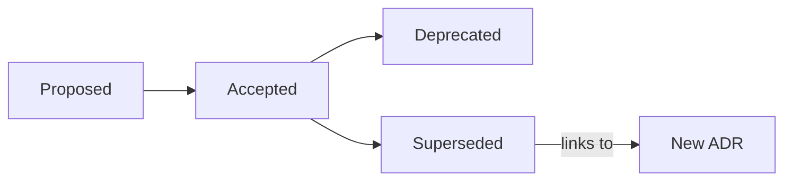

# ADR Guide

**How to Write Architecture Decision Records in ADE**

---

## Why ADRs?

Architecture Decision Records capture the **context, decision, and consequences** of significant architectural choices. In ADE, ADRs are mandatory for decisions governed by Π.3.1 (Traceable Rationale).

ADRs provide:
- **Institutional memory** — New team members understand past decisions
- **Axiom traceability** — Decisions link to governing principles
- **Change management** — Reversing decisions requires new ADRs

---

## When to Write an ADR

| Scenario                               | ADR Required? |
| -------------------------------------- | ------------- |
| Adding a new service or component      | ✅ Yes         |
| Choosing a framework or library        | ✅ Yes         |
| Changing database schema significantly | ✅ Yes         |
| Breaking API changes                   | ✅ Yes         |
| Security-sensitive changes             | ✅ Yes         |
| Bug fixes                              | ❌ No          |
| Refactoring (no behavior change)       | ❌ No          |
| Adding tests                           | ❌ No          |
| Routine dependency updates             | ❌ No          |

---

## ADR File Location

```
docs/
└── adr/
    ├── 0001-record-architecture-decisions.md
    ├── 0002-adopt-spec-kit-workflow.md
    └── ...
```

---

## ADR Template

```markdown
# ADR-{NUMBER}: {TITLE}

## Status

{Proposed | Accepted | Deprecated | Superseded by [ADR-XXXX](./XXXX-title.md)}

## Governing Postulate

`Π.{X}.{Y}` — {postulate statement}

## Context

{What is the issue that motivates this decision?}
{What constraints exist?}
{What alternatives were considered?}

## Decision

{What is the change that we're proposing and/or doing?}

## Consequences

### Positive
- {What becomes easier?}

### Negative
- {What becomes harder?}

### Neutral
- {What changes but isn't clearly positive or negative?}

## Axiom Traceability

- **Root Axiom**: `Σ.{X}` — {axiom statement}
- **Derivation Chain**: `Π.{X}.1` → `Π.{X}.2` → `Π.{X}.{Y}`
- **Constitutional Reference**: Article {N}, §{M}

## References

- [Link to spec or related documentation]
- [External resources]
```

---

## ADR Numbering

- Use 4-digit sequential numbers: `0001`, `0002`, etc.
- Never reuse numbers, even if ADRs are deprecated
- Gaps are allowed (don't renumber)

---

## ADR Status Lifecycle



- **Proposed**: Under review, not yet approved
- **Accepted**: Approved and in effect
- **Deprecated**: No longer relevant (e.g., feature removed)
- **Superseded**: Replaced by a newer decision

---

## Example ADR

```markdown
# ADR-0002: Adopt Spec-Kit Workflow

## Status

Accepted

## Governing Postulate

`Π.1.3` — Spec-Kit CLI workflow for specification creation

## Context

We need a standardized approach to creating specifications before 
implementation. Several options exist:
1. Freeform markdown documents
2. Custom templating system
3. Spec-Kit CLI workflow

Spec-Kit provides structured commands (`specify`, `plan`, `tasks`) that 
enforce our specification-first principle.

## Decision

We will adopt the Spec-Kit CLI workflow for all feature development. 
All repositories will include `.specify/` folders for feature specifications.

## Consequences

### Positive
- Consistent specification format across projects
- CLI commands enforce the ADE lifecycle
- Machine-parseable specs enable automation

### Negative
- Learning curve for new contributors
- Additional tooling dependency

### Neutral
- Specification format is now prescribed, not flexible

## Axiom Traceability

- **Root Axiom**: `Σ.1` — Specification Primacy
- **Derivation Chain**: `Π.1.1` → `Π.1.2` → `Π.1.3`
- **Constitutional Reference**: Article I, §1.3

## References

- [Spec-Kit Documentation](https://github.com/First-ADE/specify)
- [METHODOLOGY.md](./docs/METHODOLOGY.md)
```

---

## Best Practices

1. **Write ADRs at decision time** — Don't wait until after implementation
2. **Keep context focused** — Explain the problem, not the history of the universe
3. **Be specific in decisions** — "Use PostgreSQL" not "Use a relational database"
4. **Acknowledge tradeoffs** — Every decision has consequences
5. **Link to evidence** — Reference specs, benchmarks, or research
6. **Include the governing postulate** — This is what makes it ADE

---

**Version**: 1.0.0 | **Established**: 2026-02-06
